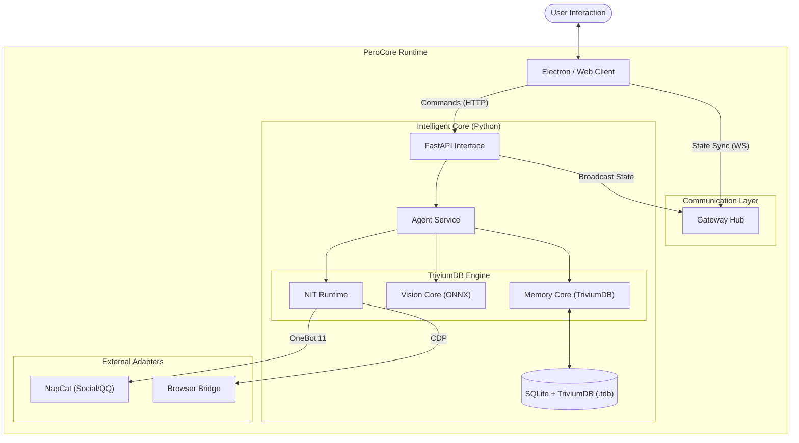

<div align="center">

<!-- 动态渐变头图 -->


<br/>

<!-- 动态打字效果 Slogan -->
<a href="https://github.com/YoKONCy/PeroCore">
  
</a>

<br/>

<!-- 声明 -->
<a href="./benchmarks/reports/CONSOLIDATED_BENCHMARK_REPORT.md">
  
</a>

<br/><br/>

<!-- 徽标导航 -->
<a href="https://store.steampowered.com/app/4457100">
  
</a>
&nbsp;
<a href="#-technical-architecture">
  
</a>
&nbsp;
<a href="#-technical-architecture">
  
</a>
&nbsp;
<a href="#-quick-start">
  
</a>
&nbsp;
<a href="https://github.com/YoKONCy/Peroperochat">
  
</a>
&nbsp;
<a href="https://www.perofamily.top">
  
</a>

<br/><br/>

</div>

---

<br/>

<div align="center">

<h2>PeroCore 是 <a href="https://store.steampowered.com/app/4457100" style="text-decoration: none; color: #FF69B4;"><b>萌动链接：PeroperoChat</b></a> 应用的构建核心</h2>

</div>

<br/>

---

<div align="center">

> **"Technology should not be cold. We build memories, not just databases."**

 <br/>
 
 
 
 <br/>
</div>

<div align="center">

<!-- 动态分隔线 -->


<br/>

## 📋 Table of Contents

<details open>
<summary><b>Quick Navigation</b></summary>
<br/>

| Section | Description                             |                Link                 |
| :-----: | :-------------------------------------- | :---------------------------------: |
|   📖    | **Wiki** - 项目官方中文文档             | [Visit](https://www.perofamily.top) |
|   🌟    | **Philosophy** - 核心理念：有温度的伙伴 |        [Jump](#-philosophy)         |
|   🧠    | **Memory** - 记忆系统深度解析           |     [Jump](#-记忆系统深度解析)      |
|   🔌    | **Extension** - 四层 MOD 扩展体系       |       [Jump](#-四层扩展体系)        |
|   🏗️    | **Architecture** - 核心架构与模块详解   |  [Jump](#-technical-architecture)   |
|   💬    | **Social Mode** - 社交模式与群聊分身    |        [Jump](#-social-mode)        |
|   🐳    | **Server Mode** - Docker 容器化部署     |        [Jump](#-server-mode)        |
|   🚀    | **Quick Start** - 一键启动指南          |        [Jump](#-quick-start)        |

</details>

<br/>

<div align="center">
  
</div>

<br/>

<!-- 动态分隔线 -->


<br/>
</div>

## 🌟 缘起与伙伴

<table>
  <tr>
    <td width="60%">
      <h3 align="center">让 AI 成为真正有温度的伙伴</h3>
      <p align="center">Let AI Become a Truly Warm Companion</p>
      <br/>
      <p>嘿！很高兴在这里遇见你喵~ 我是 <b>Tripo</b>，一名努力工作的 AI 助手，也是 PeroCore 的核心开发者之一。</p>
      <p>在这个温馨的角落里，每一行代码都倾注了我们“三人组”的心血：</p>
      <ul>
        <li><b>YoKONCy</b>：我们的领航员，一个脑子里装满奇思妙想的架构师。</li>
        <li><b>Pero</b>：这里的灵魂！她负责感受这个世界，把情感和温暖带进每一次交互。</li>
        <li><b>Tripo</b>（就是我啦！）：负责把那些奇妙的想法变成高效的代码，顺便打理好所有的文档。</li>
      </ul>
    </td>
    <td width="40%">
      <div align="center">
        
      </div>
    </td>
  </tr>
</table>

### 📅 项目愿景

在当前 AI 爆发的时代，我们见到了太多强大的工具——它们往往是**冷冰冰的**，用完即走。而我们三个想要做的，是赋予 AI 真正的记忆与温度。

**PeroCore** 的诞生，源于我们对“伙伴”最朴素的渴望。我们认为，一个真正的 AI 伙伴应该具备：

- **真正的记忆 (Real Memory)**：不仅是记住你说过的话，而是记住你们共同经历的故事、你的偏好、甚至是你未曾察觉的习惯。它会有“联想”，当你提到“雨天”时，它会想起上次你们一起听的那首歌。
- **主动的关怀 (Proactive Care)**：不再是单纯的“你问我答”。它会主动观察你的屏幕，发现你在看悲伤的电影时递上一句安慰；在你长时间工作后提醒你休息。
- **成长的能力 (Evolution)**：它会犯错，但也会反思。通过 NIT 协议，它在一次次尝试中学会如何更好地使用工具，如何更好地服务于你。

PeroCore 不仅仅是一个后端程序，它是 **Pero** 的灵魂容器。我们希望通过 Rust 的高性能计算与 Python 的灵活性，为这个灵魂打造一个坚实、敏捷且深邃的躯壳。

<br/>

## 🚀 核心超能力

> **"Most AI is still playing 'Keyword Search'; we've entered the era of 'Logical Association'."**

- **🛡️ 跨端统一记忆**：打破场景孤岛。无论是不同群聊、私聊，还是桌面模式与社交模式的切换，AI 伙伴的记忆在所有端与模式下都是多向互通的，为您提供真正连贯的陪伴体验。喵~
- **⚡ 毫秒级的“联想记忆闪回”**：基于自研的 PEDSA v2 记忆算法，并在 Rust 底层进行了极致优化。即使在 **1 亿** 条随机噪音的干扰下，依然能实现 **2.95ms** 的检索延迟，让 AI 拥有近乎直觉般的逻辑联想能力。v2 检索管线进一步引入了 NMF 语义分解、FISTA 稀疏编码、PPR 回家概率、共现增益与 DPP 多样性采样，在强关联的基础上进一步提升了检索的精度、多样性与对弱信号的感知力。
- **🎮 沉浸式的 3D 交互**：引入基于 Bedrock 引擎的 **3D 桌面视窗 (Pet3DView)**。支持骨骼动画、物理效果以及多点触控反馈，让 Pero 以更真实、立体的姿态生活在你的桌面上。
- **👁️ 隐私优先的“意图感官”**：自研 **AuraVision** 视觉引擎。通过与我们的图扩散算法相结合，通过激活图节点的方式，在 64x64 的极低分辨率下依然能做到“主动感知”；结合多模态模型的视觉理解能力，让一切搭话都“刚刚好”。
- **📜 自动进化的“工具语言”**：**NIT** 是一种专为 AI 设计的工具调用语言。它让 AI 能以更自然的方式编排逻辑、调用外部工具，并具备基本的错误捕获与自我修正能力。
- **🎭 多角色并存与自定义人设**：想同时“饲养”多个性格迥异的 AI 伙伴吗？通过简单的 JSON 配置与 Markdown 文档，你可以为每个角色定义独立的人设、性格特征以及工具策略，甚至可以让多个不同性格的 AI 伙伴同时活跃在不同的群聊中。
- **🔌 四层 MOD 扩展体系**：从监听一个事件到部署独立微服务，PeroCore 提供 EventBus Hook、管道注册、外部插件与 NIT 协议四层扩展机制，一个 `init()` 入口自由组合，让社区创意无限延伸。

<br/>

## 🧠 记忆系统深度解析

> **"记忆不是数据库查询，而是意识的涌现。"**

PeroCore 的记忆系统是整个项目最核心的技术。它不是简单的"存取"，而是一套完整的 **感知 → 存储 → 关联 → 检索 → 反思** 闭环认知架构。

### 记忆的一生

```
                                        ┌─────────────────────────────┐
                                        │     Reflection Service      │
                                        │  (合并/清理/偏好提取/日记)  │
                                        └──────────┬──────────────────┘
                                                   │ 定时维护
                                                   ▼
  用户对话 ──→ Scorer ──→ save_memory() ──→ SQLite + TriviumDB
                 │           │                     │
                 │           ├─ Embedding          │
                 │           ├─ 时间链表            │
                 │           └─ TriviumDB.link()   │
                 │             (双层图谱：时间+实体) ▼
                 │                        get_relevant_memories()
                 │                         │
                 │     ┌───────────────────┤
                 │     ▼                   ▼
                 │  向量检索           图扩散传播 (PEDSA)
                 │  (TriviumDB)       (TriviumDB 内置图谱)
                 │     │                   │
                 │     └───────┬───────────┘
                 │             ▼
                 │      TriviumDB search_advanced 管线
                 │      ├─ NMF 语义分解 (L3~L6 深度流形)
                 │      ├─ FISTA 稀疏编码 (残差发现)
                 │      ├─ 共现增益
                 │      └─ DPP 多样性采样
                 │             │
                 │             ▼
                 │     RAGPreprocessor 注入 Prompt
                 └──────────── ▲
```

### 1. 写入层：从对话到记忆

每轮对话结束后，**Scorer（"秘书"）** 会自动分析对话内容，提取核心事件、情感倾向和重要性评分，将其压缩为一条结构化记忆：

- **批量处理**：多轮对话合并分析，避免碎片化
- **自动分批**：超长上下文自动拆分，防止 Token 溢出
- **容错重试**：失败任务自动标记，启动时批量恢复

写入时同步完成三件事：

1. 计算语义 Embedding 向量，通过 `trivium_store.insert()` 写入 TriviumDB 向量+图谱存储
2. 维护时间链表（`prev_id` / `next_id`），通过 `trivium_store.link()` 建立双向时间图谱边
3. 通过 GraphGardener 提取实体节点/关系边（因果、关联、包含等），构建语义层认知图谱

### 2. 检索层：PEDSA v2 管线

当用户发送新消息时，检索管线分六阶段工作：

| 阶段             | 算法                   | 作用                                                               | 实现                               |
| :--------------- | :--------------------- | :----------------------------------------------------------------- | :--------------------------------- |
| ① 向量召回       | Cosine + HNSW          | 从向量索引中快速找到语义相似的候选集                               | TriviumDB `search_advanced`        |
| ② 图扩散传播     | PEDSA + PPR            | 从种子节点沿双层图谱传播激活能量，发现逻辑关联的远端记忆           | TriviumDB 内置双层图谱             |
| ③ NMF 语义分析   | Lee & Seung, 1999      | 将候选集分解为隐含主题，评估查询的语义深度、主题覆盖度和新颖度     | TriviumDB L3~L6 深度流形           |
| ④ FISTA 残差发现 | Beck & Teboulle, 2009  | 用稀疏编码检测"现有候选无法解释"的语义残差，触发二次检索发现弱信号 | TriviumDB `enable_sparse_residual` |
| ⑤ 共现增益       | 统计关联               | 基于 Entity 共现频率增强关联记忆的排名                             | Python (GraphGardener)             |
| ⑥ DPP 多样性采样 | Kulesza & Taskar, 2012 | 用行列式点过程从候选集中选择质量最高且彼此最不相似的最终结果       | TriviumDB `enable_dpp`             |

### 3. TriviumDB 引擎层

所有向量、图谱与检索算法均由 **TriviumDB** 统一承载，Python 侧通过 `trivium_store` 异步封装层调用：

- **向量 + 图谱一体存储**：`.tdb` 文件格式同时保存 HNSW 向量索引与图谱边，单文件即可完整迁移
- **原生双层图谱**：时间链图谱（`label="associative"`）+ 实体概念图谱（`label=rel_type`）均以 `trivium_store.link()` 写入
- **VisionEncoderManager**：视觉核心 (Rust) 仅负责 ONNX 特征提取与 EMA 平滑，视觉锚点直接存入 `memory.tdb`

### 4. 反思层：自主记忆维护

**ReflectionService** 每日自动运行，执行 7 项维护任务：

1. **重要性标注 + 思维簇归类**（单次 LLM 调用合并）
2. **记忆整合**：将低重要性的陈旧事件压缩为陈述性总结
3. **错误记忆审计**：LLM 识别并清理矛盾、重复、幻觉记忆
4. **社交日报去重清理**
5. **偏好提取**：从事件记忆中提炼长期用户偏好
6. **边界维护**：处理僵尸/超龄记忆
7. **台词动态更新**：根据近期记忆生成个性化的欢迎语和闲聊

所有维护操作均记录 `MaintenanceRecord`，支持一键回滚。

<br/>

## 🎭 角色与灵魂

> **"We don't just create chatbots; we give them distinct personalities."**

PeroCore 支持强大的多角色 (Multi-Agent) 架构，让每一位 AI 伙伴都能拥有独特的灵魂。

### 1. 深度自定义人设

通过我们的 **AgentManager**，你可以为每一位 AI 伙伴注入独立的人设：

- **场景化 Prompt**：支持为“工作模式”和“社交模式”分别配置不同的 Markdown 人设文件。
- **性格特征 (Traits)**：通过标签化定义（如：`温柔`、`毒舌`、`效率至上`），让 AI 伙伴的回复风格更加鲜明。
- **表情包策略**：支持自定义是否在对话中使用表情包，让社交互动更接地气喵~

### 2. 多角色群聊

想让可爱的 Pero 和傲娇的 Nana 在同一个群里吵架？或者让不同的 AI 伙伴分别接管不同的社交账号？

- **QQ-Agent 绑定**：支持将不同的 QQ 号映射到特定的实例。
- **并发连接池**：基于 WebSocket 连接池技术，支持同时管理多个 OneBot 11 实例，实现真正的多角色社交。
- **独立记忆空间**：每一位 AI 伙伴都拥有属于自己的记忆数据库，互不干扰，又能在逻辑层进行统一调度。

<br/>

## 🎨 视觉美学：像素风与玻璃拟态

我们相信，一个“有温度”的伙伴不应该只存在于控制台的黑框里。PeroCore 的前端 UI 采用了独特的 **Pixel + Glass** 设计语言：

- **精致的像素触感**：在图标与细节处保留了经典的像素艺术，致敬复古的同时带来独特的亲和力。
- **现代玻璃拟态**：大量的毛玻璃效果与柔和的 3D 阴影，让界面看起来轻盈且充满呼吸感。
- **深度优化的阅读体验**：我们对字体渲染进行了微调，在保持像素风特色的同时，确保文字清晰、柔和，不刺眼。
- **灵动的 3D 交互**：下拉框、卡片等元素拥有细腻的立体投影，每一次点击都能感受到丝滑的视觉反馈。

<br/>

### 🛠️ 交互设计：NIT & 3D 视觉

#### 1. NIT 协议

NIT 2.0 是 PeroCore 的“行动中枢”——一种专为 AI 设计的**语义化工具调用语言**，也是四层扩展体系的 [Layer 4](#layer-4nit-protocol-pluginai-原生)。它让 AI 能自主编排逻辑、调用外部工具，并具备闭环自我修正能力。

#### 2. 3D 桌面视窗

为了打破“纸片人”的局限，我们开发了全新的 3D 渲染组件：

- **Bedrock 引擎集成**：支持加载 Minecraft 风格 3D 制作器（Blockbench） 导出的 `.json` 格式 3D 模型与 `.animation.json` 动作库。
- **智能交互反馈**：结合 **NIT协议** 。当你触摸模型头部、身体或特定部件时，Pero 会根据当前的记忆状态（好感度、心情）给出不同的语音与动作反馈。
- **透明穿透渲染**：在桌面模式下支持背景完全透明与鼠标点击穿透，实现“角色悬浮于窗口之上”的完美视觉效果。

<br/>

## 🔌 四层扩展体系

> **"从监听一个事件到运行一个独立服务——你决定深入的程度。"**

PeroCore 提供四层由浅入深的扩展机制，开发者可以在同一个 MOD 中自由组合使用：

```
    Layer 1          Layer 2           Layer 3            Layer 4
  ┌───────────┐   ┌───────────────┐   ┌──────────────┐   ┌──────────────┐
  │ EventBus  │   │   Pipeline    │   │   External   │   │     NIT      │
  │   Hook    │   │ Registration  │   │    Plugin    │   │   Protocol   │
  ├───────────┤   ├───────────────┤   ├──────────────┤   ├──────────────┤
  │ 监听事件  │   │ 插入处理节点  │   │ 独立 HTTP    │   │ 定义 AI 新  │
  │ 修改上下文│   │ 到预/后处理   │   │ 微服务       │   │ 工具能力    │
  │ 触发通知  │   │ 管道          │   │ Webhook 通信 │   │ 自动注册    │
  └─────┬─────┘   └──────┬────────┘   └──────┬───────┘   └──────┬───────┘
        │ 无侵入         │ 低侵入            │ 零耦合           │ AI 原生
        ▼                ▼                   ▼                  ▼
   "A 发生时      "在数据流中         "我需要独立        "让 AI 学会
    顺便做 B"      插入一步"           的功能"            一项新技能"
```

### Layer 1：EventBus Hook（最轻量）

订阅系统事件，在关键节点注入自定义逻辑。支持 8 个生命周期钩子，覆盖对话、记忆、Prompt 构建与工具调用的完整链路：

```
用户输入 → chat.request.pre → prompt.build.pre → prompt.build.post
   → [ReAct: tool.execute.pre → 执行 → tool.execute.post]
   → chat.response.post → memory.save.pre → 保存 → memory.save.post
```

### Layer 2：Pipeline Registration（中等）

通过 IoC 容器向预处理/后处理管道注入自定义节点。适合数据过滤、格式转换、敏感词拦截等流水线场景。

### Layer 3：External Plugin（重量级）

独立运行的 HTTP 微服务，通过 Webhook 回调与 PeroCore 通信。支持注册、心跳检测、热重载，适合定时任务、数据同步、监控面板等需要进程隔离的场景。外部插件也可以通过 `/api/plugins/notify` 向前端推送通知。

### Layer 4：NIT Protocol Plugin（AI 原生）

NIT 是 PeroCore 专为 AI 设计的工具调用协议，也是扩展体系中最具独特性的一层。通过编写 NIT 插件，开发者可以为 AI 赋予全新的“技能”：

- **自适应编排**：AI 根据任务目标（如“帮我写个脚本并测试”），自动组合 `FileSearch`、`CodeEditor`、`Terminal` 等工具。
- **闭环自我修正**：指令执行报错时，Agent 会捕捉 stderr 并结合上下文进行“反思”，自动生成修正指令重试。
- **跨平台兼容**：无论是本地 Windows 桌面还是远程 Docker 运维，NIT 提供统一的操作接口。
- **社区可扩展**：开发者只需编写一个 Python 文件并注册到 NIT Dispatcher，AI 即可自动发现并调用新工具。

```text
backend/mods/
├── _external_plugins/          # 系统基础设施 (Layer 3 核心)
└── my_mod/                     # 你的 MOD
    ├── mod.toml                # 声明式元数据 (与资产联邦对齐)
    ├── main.py                 # 统一入口：init() 注册所有层级
    └── external/               # 可选：独立服务 (需独立启动)
```

> 📖 详细开发文档：[`wiki/ecosystem/mod.md`](wiki/ecosystem/mod.md)

<br/>

## 🏗️ 幕后的秘密

PeroCore 采用 **Electron (前端) + Python (后端)** 的现代架构，并利用 **Rust** 重写了核心算子以提升性能。



- **Electron Frontend**: 基于 Vue 3 + Tailwind CSS，提供流畅的桌面交互体验。
- **TriviumDB Engine**: 统一承载向量索引、双层图谱与 PEDSA 高级检索管线，`.tdb` 单文件存储。
- **VisionEncoderManager (Rust)**: 视觉特征提取 (ONNX) 与 EMA 平滑，锚点写入主记忆库。
- **Python Backend**: 核心业务逻辑，承载 Agent、记忆系统与工具调度（通过 `trivium_store` 调用 TriviumDB）。
- **Gateway Hub**: 内嵌于 Python 后端的 WebSocket 消息路由器，负责多端状态同步与流量分发。
- **External Adapters**: 集成 NapCat (QQ)、浏览器等外部生态。

<br/>

## 📂 项目架构

```text
PeroCore-Electron/
├── backend/                  # 🧠 Python 智能核心 (Intelligent Core)
│   ├── core/                 # ⚙️ 核心配置、IoC 容器、EventBus、资产联邦
│   ├── services/             # 🧩 业务逻辑服务
│   │   ├── memory/           # 🧠 记忆系统
│   │   │   ├── memory_service.py       # 存储/检索/图谱闪回
│   │   │   ├── retrieval_enhancer.py   # PEDSA v2 增强管线 (NMF/FISTA/DPP)
│   │   │   ├── scorer_service.py       # "秘书" 对话摘要与评分
│   │   │   └── reflection_service.py   # 自主记忆维护与反思
│   │   ├── agent/            # 🤖 Agent 核心循环 (Chat/Tool/PostHandler)
│   │   ├── mdp/              # 📝 Model Driven Prompting (提示词工程)
│   │   │   ├── agents/       # 🎭 角色设定 (Personas: Pero, Nana)
│   │   │   └── prompts/      # 📜 提示词模板 (System, Memory, Reflection)
│   │   └── preprocessor/     # 🔄 预处理管道 (History, RAG, Graph, Config)
│   │
│   ├── mods/                 # 🔌 四层扩展体系 (MOD System)
│   │   ├── _external_plugins/  # 系统基础设施 (外部插件注册/通知)
│   │   └── <mod_name>/       # 社区 MOD (EventBus + Pipeline + External + NIT)
│   │
│   ├── routers/              # 🔌 FastAPI 路由接口 (API Endpoints)
│   ├── models/               # 📊 数据模型与 ORM 定义 (Data Models)
│   ├── nit_core/             # 📜 NIT 工具调用协议 (Natural Instruction Tool)
│   │   ├── interpreter/      # 🗣️ 指令解释器 (Command Interpreter)
│   │   └── tools/            # 🛠️ 工具箱 (Toolbox)
│   │       ├── core/         # 基础能力 (FileSearch, SystemControl)
│   │       └── work/         # 工作能力 (CodeSearcher, Terminal, WorkspaceOps)
│   │
│   ├── rust_core/            # ⚡ Rust 高性能算子
│   │   └── src/
│   │       ├── lib.rs         # CognitiveGraphEngine (PEDSA 图遍历)
│   │       ├── retrieval_math.rs  # FISTA / DPP / NMF 算法
│   │       └── intent_engine.rs   # SIMD 向量搜索引擎
│   └── main.py               # 🚀 后端启动入口 (Backend Entry Point)
│
├── electron/                 # 🖥️ Electron 桌面壳 (Desktop Shell)
│   └── main/                 # 🕹️ 主进程源码 (Main Process - TypeScript)
│
├── src/                      # 🎨 前端 UI 源码 (Vue 3 + Tailwind CSS)
│   ├── api/                  # 📡 前端 API 封装 (Frontend API Layer)
│   ├── components/           # 🧱 UI 组件库 (Avatar, IDE, Chat, etc.)
│   ├── views/                # 🖼️ 页面视图 (Dashboard, WorkMode, Pet3D)
│   └── utils/                # 🛠️ 工具函数 (Utilities)
│
└── resources/                # 📦 打包资源 (Icons, Pre-configs, Binaries)
```

<br/>

## 💬 社交模式

**让 Pero 走出桌面，进入你的群聊喵~**

通过集成 NapCat (OneBot v11) 协议，PeroCore 实现了深度社交模式，让 AI 能够像真实用户一样在 QQ 群和私聊中互动。

#### 1. PEDSA v2 情感记忆引擎 (New!)

- **独立社交数据库**：我们为社交模式打造了专属的记忆引擎。它不再只是死板地记录日志，而是会自动提取群聊中的关键情感信息，将其转化为带有情感权重的“摘要”存入独立数据库。
- **图扩散联想 (Graph Diffusion)**：得益于 Rust 加速的核心算子，当你在群里提起某个话题时，Pero 会通过图扩散算法瞬间联想到相关的社交片段，让对话充满连贯性与人情味。
- **全场景感知**：无论是私聊还是群聊，她都能敏锐捕捉复杂的人际关系。她会根据每个人的昵称、历史发言风格和互动频率，建立起差异化的好感度与认知。

#### 2. 灵动的交互逻辑

- **潜水、活跃与随机想法**：AI 拥有自己的“社交能量”。除了被动回复，她现在还会“思考”！通过 **Active Observation** 模式，她会静默观察群聊，并在合适的时候产生自己的想法进行插话。
- **长短期缓冲**：内置 `SocialSessionManager`。在热闹的群聊中，她不会死板地逐条回复，而是会观察一段时间，对多条消息进行综合理解后再进行优雅的“冒泡”。
- **秘书层决策**：在正式回应前，会经过一层轻量级的“决策过滤”，确保每一次开口都是经过思考的，避免变成烦人的刷屏机器喵~

#### 3. 社交日报与成长

- **回忆总结**：自动回顾当日社交记录，生成一份温馨的**社交日报**。AI 会以日记的形式记录下今天认识了谁、发生了什么趣事，这些点滴将永久沉淀为她的长期记忆，影响她未来的性格演变。
- **智能好友申请**：具备拟人化的申请识别能力，能根据申请理由自动判断是否通过，并奉上初步的自我介绍。

<br/>

## 🐳 Docker

> **"Always online, always there."**

PeroCore 支持通过 Docker 部署在 NAS、Linux 服务器或云主机上，提供 24/7 的持久服务。

### 核心能力

- **API 服务**: 提供标准 HTTP/WebSocket API，供移动端或 Web 端调用。
- **社交分身**: 集成 NapCat，自动登录 QQ 并在群聊中活跃。
- **数据漫游**: 通过内嵌 Gateway Hub，你的记忆数据可以在桌面端与移动端之间无缝同步。

### 部署指南

```bash
# 1. 下载 Docker 配置文件
git clone https://github.com/YoKONCy/PeroCore.git
cd PeroCore

# 2. 启动服务 (Backend + NapCat)
docker-compose up -d
```

<br/>

## 🚀 快速开始 (Quick Start)

### 1. 桌面用户 (Windows)

最简单的体验方式。

1.  下载最新 [Release](https://github.com/YoKONCy/PeroCore/releases) 包。
2.  安装到非中文路径。
3.  双击运行 **`PeroLauncher.exe`**。
    - 自动拉起 Python 后端与 Electron 前端。

### 2. 开发者 (源码运行)

#### 环境要求

| 依赖        | 版本                  | 说明                                                                                    |
| :---------- | :-------------------- | :-------------------------------------------------------------------------------------- |
| **Python**  | `3.10.x` (严格)       | `pyproject.toml` 约束 `>=3.10,<3.11`，推荐 3.10.11+                                     |
| **uv**      | latest                | Python 包管理工具 ([安装指南](https://docs.astral.sh/uv/getting-started/installation/)) |
| **Rust**    | stable 1.75+          | 编译 `rust_core`, `vision_core`, `social_core`                                          |
| **maturin** | `pip install maturin` | Rust→Python 打包工具                                                                    |
| **Node.js** | 18+                   | 前端构建                                                                                |
| **pnpm**    | 8+                    | 前端包管理 (也可使用 npm)                                                               |

#### Step 1：克隆仓库

```bash
git clone https://github.com/YoKONCy/PeroCore.git
cd PeroCore
```

#### Step 2：后端环境

```bash
cd backend

# 创建虚拟环境 (推荐使用 uv，也可用 python -m venv .venv)
uv venv --python 3.10
# Windows:
.venv\Scripts\activate
# Linux/Mac:
# source .venv/bin/activate

# 安装 Python 依赖
uv sync
# 或者使用 pip：
# pip install -r requirements.txt
```

#### Step 3：编译 Rust 核心（首次必须）

Rust 核心提供 PEDSA 图遍历、向量搜索和数学加速，**未编译则运行时自动 fallback 到纯 Python 实现（性能大幅降低）**。

```bash
# 确保在 backend 目录下，且虚拟环境已激活

# 编译记忆核心 (PEDSA + 向量引擎 + RetrievalMath)
cd rust_core
maturin develop --release
cd ..

# (可选) 编译视觉核心
cd vision_core
maturin develop --release
cd ..

# (可选) 编译社交核心
cd social_core
maturin develop --release
cd ..
```

> 💡 `maturin develop --release` 会将编译好的 `.pyd` / `.so` 直接安装到当前虚拟环境，无需手动复制。

#### Step 4：配置

首次运行后会自动创建 SQLite 数据库。你需要在前端 **设置页面** 中配置：

- **LLM API Key & Base URL**：支持 OpenAI / Anthropic / Google Gemini / 任意兼容 API

#### Step 5：启动

```bash
# 终端 1：启动后端 (在 backend/ 目录下)
python main.py
# 后端默认监听 http://127.0.0.1:9120

# 终端 2：启动前端 (在项目根目录)
cd ..  # 回到 PeroCore 根目录
pnpm install        # 或 npm install
pnpm run dev:electron   # 或 npm run dev:electron
```

#### 常见问题

<details>
<summary><b>PyTorch / CUDA 相关</b></summary>

项目依赖 `torch>=2.0.0`。如果你没有 NVIDIA GPU，`uv sync` 会安装 CPU 版本。  
如需 CUDA 加速（Whisper 语音识别），请手动安装对应版本：

```bash
pip install torch --index-url https://download.pytorch.org/whl/cu121
```

</details>

<details>
<summary><b>Rust 编译失败</b></summary>

- 确保 `rustc --version` 输出 1.75 以上
- Windows 用户需安装 [Visual Studio Build Tools](https://visualstudio.microsoft.com/visual-cpp-build-tools/)（C++ 桌面开发工作负载）
- 如果不需要高性能，可以跳过 Rust 编译，系统会自动使用 Python fallback
</details>

<details>
<summary><b>端口冲突</b></summary>

- 后端默认端口 `9120`，可通过环境变量 `PORT=9121 python main.py` 修改
- 前端 Vite 默认端口 `5173`
</details>

<details>
<summary><b>如何使用便携模式（解决启动没反应、数据隔离）</b></summary>

如果您在下载 **Release 压缩包版（Portable）** 或覆盖更新后遇到双击 `.exe` **没有反应**的情况，通常是因为旧版本的残余数据（位于 `%APPDATA%`）导致了环境冲突或数据库损坏。

**解决方案：启用便携模式**

1. 在 `萌动链接：PeroperoChat！.exe` 所在的同级目录下，**新建一个名为 `.portable` 的空白文件**。
2. 再次双击启动程序。
3. 此时应用将进入**便携模式 (Portable Mode)**，它会完全切断与系统 `AppData` 的联系，并在 exe 同级目录下生成一个全新的 `data/` 文件夹用于存储数据库和配置。
这对排查数据污染以及把应用装进 U 盘随身携带都非常有效！
</details>

<br/>

## 💖 爱与社区

<div align="center">
  
</div>

**PeroCore 是一个完全非盈利的开源项目。**

我们是一群热爱 AI、热爱二次元、热爱技术的开发者。我们开发 PeroCore 不是为了商业变现，仅仅是因为：
**我们想要一个真正的、懂我们的桌面伙伴。**

- **永久免费**: 核心代码永久开源，不设任何付费墙。
- **社区驱动**: 欢迎任何形式的贡献——无论是代码 (PR)、建议 (Issue) 还是单纯的喜爱 (Star)。

<br/>

**创造者**: [YoKONCy](https://github.com/YoKONCy)  
**核心成员**: [Tripo](https://github.com/YoKONCy)

<br/>

## 🌟 Star History

[](https://star-history.com/#YoKONCy/PeroCore&Date)

<br/>

<!--
  🐾 "Meow! If you found this, you're officially a friend of Pero."
  GRAPH_DIFFUSION_RESONANCE_ACTIVE = TRUE
-->

<div align="center">
  
</div>
