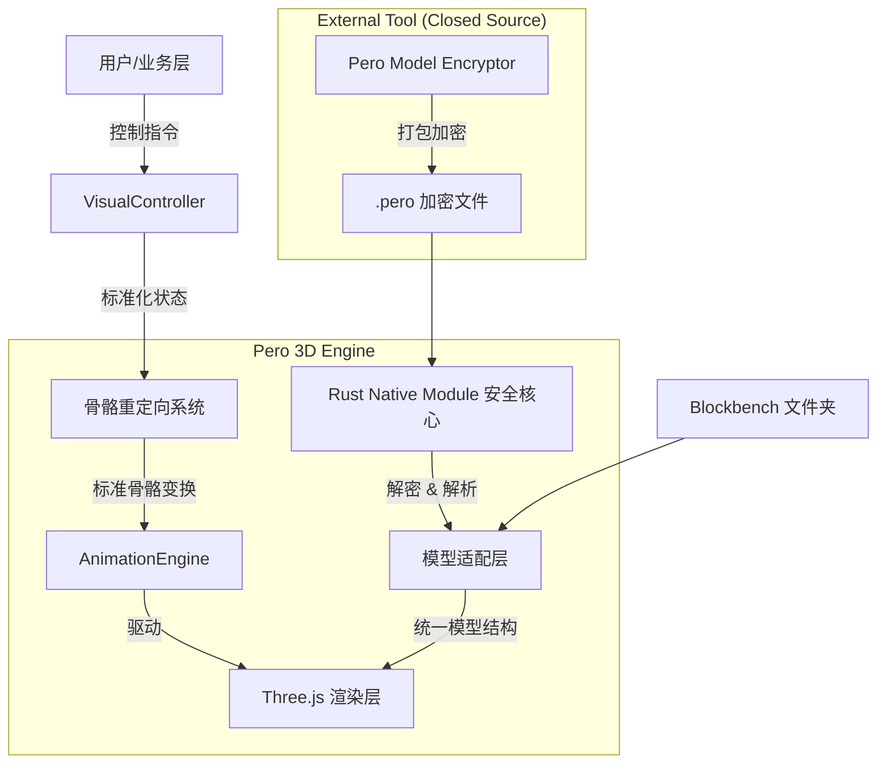

# PeroCore 3D 渲染引擎重构技术方案

## 1. 背景与现状

目前的 3D 渲染引擎（基于 Three.js）是为了快速验证概念而构建的，深度耦合了特定模型 **"Rossi"** 的实现细节。随着项目发展，这种紧密耦合带来了严重的可扩展性、兼容性和安全性问题。

**核心痛点：**

1.  **强耦合**：更换模型会导致渲染错误、动画失效、材质异常。
2.  **安全性低**：模型源文件（JSON/PNG）明文暴露，容易被提取和盗用。
3.  **兼容性差**：无法兼容主流的 Blockbench (Benchblock) 导出格式及不同版本的 YSM (Yes Steve Model) 格式。
4.  **动画局限**：内置交互动画（如拖拽、抚摸）依赖特定骨骼名称，无法在不同模型间通用。

---

## 2. 问题详细分析

### 2.1 代码耦合点 (The 4 Couplings)

1.  **骨骼层级硬编码**：`BedrockLoader` 中包含针对 Rossi 的特定过滤逻辑（如过滤 `GUI` 骨骼），以及基于特定名称（`UpperBody` 等）的自动父子级绑定。
2.  **部件状态绑定**：`BedrockAvatar` 直接操作特定名称的网格（`Dress`, `Hat`, `embarrassed`），并包含硬编码的坐标修正（如腮红 Z 轴偏移）。
3.  **动画状态逻辑**：业务逻辑（如 `isShy`）直接驱动模型显示，且依赖模型内部特定的状态机结构。
4.  **材质参数固化**：PBR 材质参数（粗糙度 0.4，金属度 0.1）是硬编码的，无法为不同模型提供不同的质感。

### 2.2 架构缺陷 (The 3 Major Issues)

1.  **缺乏加密层**：直接 Fetch 请求 JSON 和 PNG，没有任何加密措施。模型作者通常不愿意在无保护的情况下分发模型。
2.  **格式碎片化**：Blockbench 标准导出、YSM 旧版、YSM 新版的文件结构和字段定义各不相同，目前缺乏统一的适配层。
3.  **骨骼命名冲突**：内置动画系统假设了特定的骨骼命名（如 `Head`），而不同模型可能有不同的命名习惯（如 `my_head`, `head_bone`），导致动画无法驱动新模型。

---

## 3. 重构架构设计

为了解决上述问题，我们需要引入 **分层架构**，将核心渲染逻辑与具体模型数据解耦。

### 3.1 总体架构图



### 3.2 关键模块设计

#### A. 安全核心 (PeroRenderCore - Rust Native Module)

- **目标**：保护模型资产，提供高性能解析，利用 Native 环境进行深度反调试。
- **技术栈**：Rust + N-API (napi-rs) + Binary Obfuscation。
- **职责**：
  1.  **文件读取与解密**：
      - 直接在 Native 层读取 `.pero` 文件，绕过 JS 层的文件系统 API。
      - **算法防护**：使用**非标准变种算法**（如修改过的 ChaCha20-Poly1305 或 AES S-Box）。
      - **密钥防护**：采用**高强度密钥混淆**、**编译时计算**和**白盒加密**思想。
      - **深度反调试 (Anti-Debug)**：
        - 调用 OS API (如 `IsDebuggerPresent`) 检测调试器。
        - 检测父进程和钩子 (Hooks)。
        - 使用二进制加壳/混淆技术 (如控制流平坦化) 对抗静态分析。
  2.  **解析**：解析 JSON 结构，计算 UV 和顶点数据。
  3.  **输出**：向 JS 层返回 `Float32Array` (Geometry Data) 和 `Uint8Array` (Texture Blob)，**严禁**返回原始 JSON 字符串。

#### A+. 外部模型加密工具 (Pero Model Encryptor - Independent CLI/GUI)

- **定位**：独立闭源工具，不随主程序分发。
- **功能**：接受 Benchblock/YSM 原始文件，输出 `.pero` 加密包。
- **使用场景**：模型制作者使用此工具打包模型，然后将 `.pero` 文件分发给用户或上传到创意工坊。主程序仅包含解密能力。

#### B. 模型适配层 (Model Adapter Layer)

- **目标**：抹平不同模型格式的差异。
- **接口定义**：
  ```typescript
  interface IModelProvider {
    // 获取统一的模型结构描述
    getModelManifest(): Promise<AvatarManifest>
    // 获取纹理（可能是解密后的 Blob URL）
    getTexture(): Promise<THREE.Texture>
    // 获取原始动画数据
    getAnimations(): Promise<AnimationData>
  }
  ```
- **实现策略**：
  - `BlockbenchProvider`: 解析标准导出。
  - `YsmLegacyProvider`: 解析旧版 YSM。
  - `PeroSecureProvider`: 对接 Rust Core。

#### C. 骨骼重定向系统 (Retargeting System)

- **目标**：让一套内置动画驱动所有模型。
- **标准骨架 (Pero Standard Skeleton)**：
  定义一套虚拟骨骼：`Root`, `Spine`, `Chest`, `Head`, `Arm_L`, `Arm_R`, `Leg_L`, `Leg_R`。
- **映射配置 (Bone Mapping)**：
  每个模型需提供一份映射表：
  ```json
  {
    "Pero_Head": "Rossi_Head_Bone",
    "Pero_Arm_L": "left_arm_upper"
  }
  ```
- **运行时逻辑**：
  当系统播放“摸头”动画时，实际上是操作 `Pero_Head`。重定向系统查找映射表，将变换应用到当前模型的 `Rossi_Head_Bone` 上。

#### D. 视觉配置清单 (Avatar Manifest)

- **目标**：消除硬编码的部件名称和参数。
- **配置文件 (`manifest.json`)**：
  ```json
  {
    "meta": { "name": "Rossi", "version": "1.0" },
    "rendering": {
      "roughness": 0.4,
      "metalness": 0.1,
      "cameraTarget": [0, 21, 0]
    },
    "parts": {
      "dress": ["Dress_Mesh", "BreastDress_Mesh"],
      "blush": { "mesh": "embarrassed", "zOffset": -1.2 }
    }
  }
  ```

---

## 4. 实施路线图 (Roadmap)

### 第一阶段：解耦与配置化 (Decoupling)

- **任务**：
  1.  提取 `BedrockLoader` 中的 Rossi 特有逻辑到 `RossiConfig`。
  2.  实现 `AvatarManifest` 结构，修改加载器以读取配置而非硬编码。
  3.  重构 `BedrockAvatar.vue`，通过配置驱动部件可见性。
- **产出**：代码中不再包含 "Rossi" 字样，支持通过 JSON 配置加载 Rossi。

### 第二阶段：适配与重定向 (Adapter & Retargeting)

- **任务**：
  1.  定义 `IModelProvider` 接口。
  2.  实现 `BlockbenchProvider` 和 `YsmProvider`。
  3.  实现基础的骨骼重定向逻辑，确保内置的“拖拽”动画在非 Rossi 模型上也能工作。
- **产出**：支持加载第三方 Blockbench 模型，且内置交互正常。

### 第三阶段：安全核心 (Security Core)

- **任务**：
  1.  开发 Rust 库 `pero_model_core`，包含解密和解析逻辑。
  2.  开发**独立闭源**的 GUI 工具 `PeroEncryptor`，用于模型打包。
  3.  实现 `.pero` 格式的加载。
- **产出**：支持加密模型加载，且加密工具与主程序物理隔离。
- **目标**：保护模型资产，提供高性能解析，利用 Native 环境进行深度反调试。
- **技术栈**：Rust + N-API (napi-rs) + Binary Obfuscation。
- **职责**：
  1.  **文件读取与解密**：
      - 直接在 Native 层读取 `.pero` 文件，绕过 JS 层的文件系统 API。
      - **算法防护**：使用**非标准变种算法**（如修改过的 ChaCha20-Poly1305 或 AES S-Box）。
      - **密钥防护**：采用**高强度密钥混淆**、**编译时计算**和**白盒加密**思想。
      - **深度反调试 (Anti-Debug)**：
        - 调用 OS API (如 `IsDebuggerPresent`) 检测调试器。
        - 检测父进程和钩子 (Hooks)。
        - 使用二进制加壳/混淆技术 (如控制流平坦化) 对抗静态分析。
  2.  **解析**：解析 JSON 结构，计算 UV 和顶点数据。
  3.  **输出**：向 JS 层返回 `Float32Array` (Geometry Data) 和 `Uint8Array` (Texture Blob)，**严禁**返回原始 JSON 字符串。

#### 外部模型加密工具 (Pero Model Encryptor - Independent CLI/GUI)

- **定位**：独立闭源工具，不随主程序分发。
- **功能**：接受 Benchblock/YSM 原始文件，输出 `.pero` 加密包。
- **使用场景**：模型制作者使用此工具打包模型，然后将 `.pero` 文件分发给用户或上传到创意工坊。主程序仅包含解密能力。

---

## 5. 结论

通过本次重构，PeroCore 将从一个“单一模型演示”转变为一个“通用虚拟人引擎”。这不仅解决了当下的崩溃风险，更为未来的模型生态（用户上传、创意工坊）奠定了坚实的技术基础。
