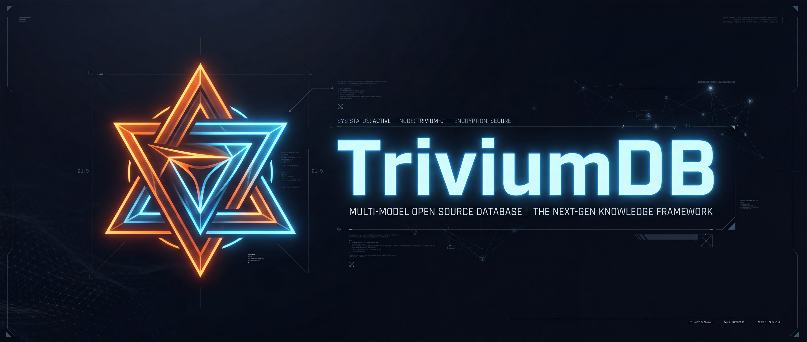
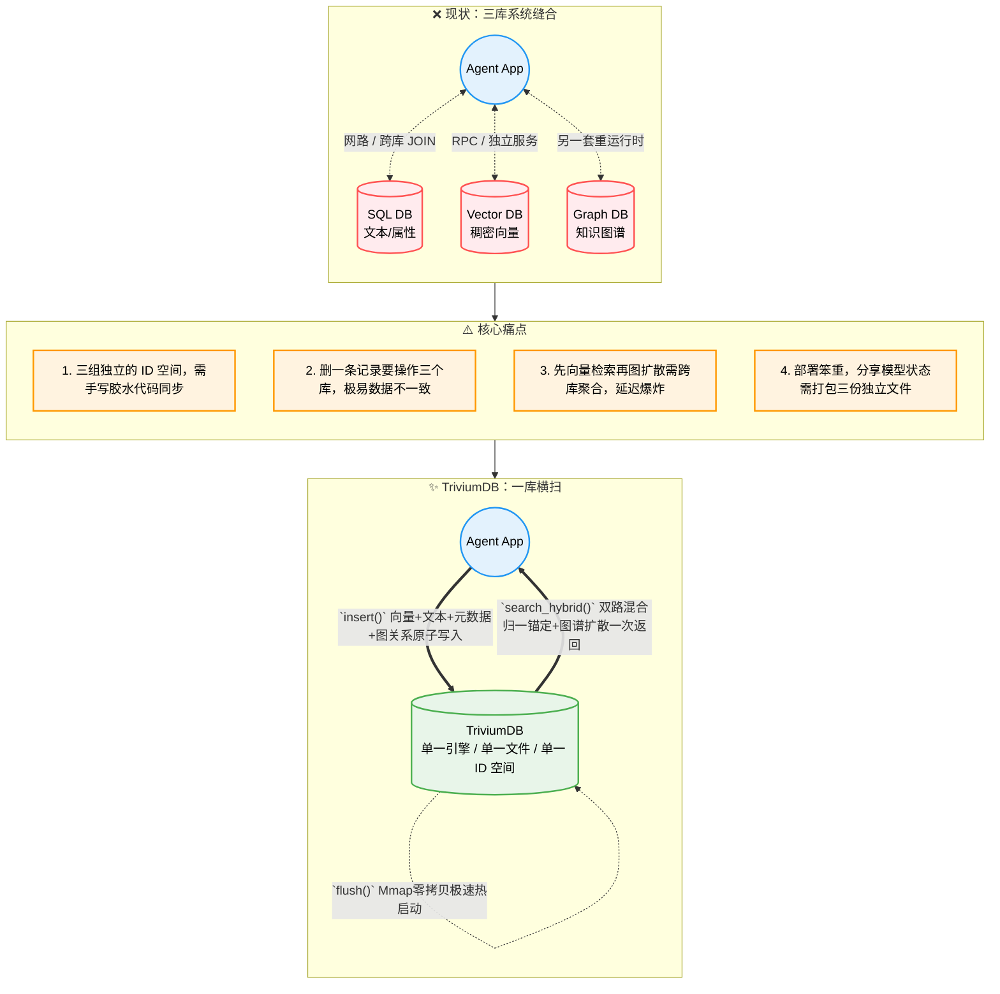

<br/><br/>

<div align="center">

<!-- 动态打字效果 Slogan -->
<a href="https://github.com/YoKONCy/TriviumDB">
  
</a>

<br/>

# TriviumDB

**向量 × 图谱 × 关系型 —— 三位一体的 AI 原生嵌入式数据库**

> _Trivium_：拉丁语，意为"三条道路的交汇"。

> “_TriviumDB_ 定位是 AI 应用领域的嵌入式数据库，旨在解决单机环境下 Agent 复杂上下文和多模态记忆编织的痛点。如果是需要支撑千万并发的高可用分布式后端，请依然选择大型集群化组件！”

[](https://www.rust-lang.org/)
[](https://pypi.org/)
[](LICENSE)

</div>

---

## 一句话介绍

TriviumDB 是一个用纯 Rust 编写的**嵌入式单文件数据库引擎**，将**向量检索（Vector）**、**属性图谱（Graph）**和**关系型元数据（Relational）**原生融合在同一个存储内核中。

我们的目标是成为 **AI 应用领域的 SQLite**：

- 🗃️ **Rom/Mmap 双引擎切换** —— 既支持单文件 `*.tdb` 复制走人，也支持分离 `.vec` 向量文件按需 mmap 零拷贝加载
- 🔗 **节点即一切** —— 每个节点天然同时拥有限定长度的稠密向量、稀疏文本倒排词频、元数据和图关系，ID 全局唯一，绝不错位
- 🧠 **为 AI 而生** —— 可选启用“AC自动机+BM25稀疏文本”与“Dense Vector稠密向量”的**多路召回**来触发图谱扩散检索，并内置多层认知管线（FISTA / DPP / PPR）
- 🛡️ **四层物理防弹衣** —— 原子替换 + WAL日志 + 事务干跑验证（Dry-Run）+ Mmap COW 隔离，断电断存不毁库
- 🐍 **Python / Node.js 原生** —— `pip install` 或 `npm install` 后直接使用，类 MongoDB 查询语法
- ⚡ **高性能检索** —— rayon 并行暴力搜索（小规模 100% 精确）+ BQ 三阶段火箭自适应索引（2 万节点以上自动加速），无需手动配置
- 💾 **SSD 友好** —— Append-Only WAL + 后台 Compaction 线程（同时自动重建 BQ 索引），杜绝随机写入磨损

---

<div align="center">

<!-- 动态分隔线 -->


<br/>

  
</div>

<br/>

## 为什么需要 TriviumDB？

### 当前 AI 应用的「三库割裂」困境

几乎所有的 AI 应用（Agent / RAG / 推荐系统）都同时需要三种数据能力，但市面上没有一个引擎能同时原生支持它们：



### 一个具体的例子

假设你在做一个 **AI 对话记忆系统**，用户说了一句「我昨天和小红去了咖啡馆」：

| 步骤         | 传统三库方案                 | TriviumDB                          |
| ------------ | ---------------------------- | ---------------------------------- |
| ① 存语义向量 | 调 Qdrant API 写入 embedding | `db.insert(vec, payload)` 一步完成 |
| ② 存元数据   | 调 SQLite 写入时间、场景     | ↑ 同一步，payload 里就是 JSON      |
| ③ 存关系     | 调 Neo4j: 用户→地点→人物     | `db.link(user, cafe, "went_to")`   |
| ④ 后续召回   | 3 次跨库查询 + 手写合并      | `db.search(vec, expand_depth=2)`   |
| ⑤ 迁移数据   | 导出 3 份 + 写转换脚本       | 复制 `memory.tdb` 一个文件         |

### 适用场景

| 场景                     | 怎么用 TriviumDB                                                                                      |
| ------------------------ | ----------------------------------------------------------------------------------------------------- |
| 🤖 **AI Agent 长期记忆** | 每条对话存为节点（embedding + 原文 + 时间戳），人物/地点/事件之间建边，召回时先向量匹配再沿关系链扩散 |
| 🎮 **游戏 NPC 认知引擎** | NPC 观察到的事件存为带向量的节点，NPC 之间的关系用图谱表达，对话时检索相关记忆自动生成回应            |
| 📚 **个人知识库**        | Markdown 笔记切片后存入，概念之间手动或自动连边，语义搜索 + 知识图谱导航双模式浏览                    |
| 🔬 **小型推荐系统**      | 用户和物品各为节点，交互行为存为带权边，混合检索实现「相似用户喜欢的 + 你的社交圈在看的」             |
| 🧬 **生物信息学**        | 基因/蛋白质序列的 embedding + 互作关系网络，一库搜到相似序列并自动追溯代谢通路                        |

---

## 快速上手

### 安装

> 💡 TriviumDB 核心使用 Rust 编写，但我们已经在云端为您提前交叉编译了所有平台的二进制，**无需在本地安装任何编译环境即可秒速安装！**

### 🐍 Python 用户

推荐使用超快的 [uv](https://github.com/astral-sh/uv) （只需毫秒级）：

```bash
uv pip install triviumdb
```

或者使用传统 pip：

```bash
pip install triviumdb
```

### 🌐 Node.js / 前端用户

跨平台包已自带 `*.node` 预编译拓展，并含有完整的 TypeScript 补全：

```bash
npm install triviumdb
# 或者
pnpm add triviumdb
```

### 🦀 Rust 原生用户

直接把我们当成 Library 依赖：

```bash
cargo add triviumdb
```

### 30 秒入门

```python
import triviumdb

with triviumdb.TriviumDB("memory.tdb", dim=3) as db:
    id1 = db.insert([0.12, -0.45, 0.78], {"text": "小明喜欢吃苹果"})
    id2 = db.insert([0.08, -0.52, 0.81], {"text": "小红送了小明一箱苹果"})
    db.link(id1, id2, label="caused_by", weight=0.95)

    results = db.search([0.10, -0.48, 0.80], top_k=5, expand_depth=2, min_score=0.6)
    for hit in results:
        print(f"[{hit.id}] score={hit.score:.3f} | {hit.payload}")
```

> 📖 完整 API 参考、高级用法和 Rust 示例请查看 **[API 参考文档](docs/api-reference.md)**。

---

## 核心特性

| 特性                  | 说明                                                                                                           |
| --------------------- | -------------------------------------------------------------------------------------------------------------- |
| 🔍 **混合检索**       | 向量锚定 → Top-K → 图谱扩散（Spreading Activation）→ 最终排序                                                  |
| 🧠 **认知管线**       | 内置九层认知管线：FISTA 残差寻隐 / PPR 图扩散 / DPP 多样性采样 / 疲劳不应期，运行时可自适应开关                |
| 📦 **三位一体 O(1)**  | 自动增量 O(1) **FreeList 墓碑空洞复用**；删节点 O(1) **Reverse Hash Net 反向边网**，彻底杜绝盘面膨胀与图谱雪崩 |
| ⚡ **自适应并行索引** | **Parallel Bit-Tag Array (隐式特征布隆阵列)** 打爆 JSON 拦截开销；外加 BQ / BruteForce 自适应向量路由无缝切换  |
| 💾 **双模式存储**     | Mmap（大模型极速分体冷启动） / Rom（传统 SQLite 级单文件打包携带），无缝热切换                                 |
| 🛡️ **四层灾备防御**   | 预写日志(WAL) + 写入原子替换 + 事务预检干跑(Dry-Run) + OS 内存写时复制隔离                                     |
| 🔄 **零开销事务**     | `begin_tx()` 验证前置架构，中途报错绝不污染内存，实现真正的零代价原子回滚                                      |
| 🔎 **高级过滤**       | 类 MongoDB 语法：`$eq/$ne/$gt/$lt/$in/$and/$or`                                                                |
| 📝 **图谱查询**       | 内置类 Cypher 查询引擎：`MATCH (a)-[:knows]->(b) WHERE b.age > 18 RETURN b`                                    |
| 🐍 **Python 原生**    | PyO3 绑定，`pip install` 后直接 `import triviumdb`                                                             |
| 🌐 **Node.js 原生**   | napi-rs 绑定，`npm install` 后直接 `require('triviumdb')`                                                      |

> 📖 深入了解架构设计和技术细节请查看 **[支持特性详解](docs/features.md)**。

---

## 向量索引策略

TriviumDB 采用**智能自适应双引擎**向量索引，全程自动路由，无需手动配置：

| 阶段           | 引擎                      | 激活条件                            | 特点                                                               |
| -------------- | ------------------------- | ----------------------------------- | ------------------------------------------------------------------ |
| **小规模热区** | BruteForce                | < 2 万节点（或 BQ 未就绪）          | 100% 精确召回，rayon 多核，延迟极低                                |
| **大规模冷区** | **BQ 三阶段火箭**（自研） | ≥ 2 万节点，Mmap 模式，后台自动构建 | 三阶段加速管线：二进制指纹粗排 → Hamming 筛选 → f32 精排，无需重建 |

**BQ（Binary Quantization）** 是 TriviumDB 的自研向量索引引擎，与 HNSW 等图结构索引相比：

- ✅ **零图维护开销**：删除/更新节点不破坏索引，没有 Ghost Node 陷阱
- ✅ **SSD 友好**：索引元数据落入 `.tdb` 头部，重启零开销恢复（bytemuck 零拷贝）
- ✅ **全自动**：2 万节点以上后台 Compaction 时自动重建，前台查询透明路由
- ✅ **硬件亲和**：纯线性扫描 + CPU 原生 Popcount 指令，完美适配硬件 Prefetcher，缓存命中率接近 100%

```toml
# 启用 Python 绑定
maturin develop --features python
```

---

## 项目结构

```
TriviumDB/
├── src/
│   ├── lib.rs              # 库入口 + 公开 API
│   ├── database.rs         # Database 核心（SearchConfig + search_advanced）
│   ├── cognitive.rs        # 认知算子（FISTA / DPP / NMF）
│   ├── node.rs             # Node / Edge / SearchHit 数据结构
│   ├── vector.rs           # VectorType Trait（f32 / f16 / u64）
│   ├── filter.rs           # 高级过滤引擎 ($gt/$lt/$in/$and/$or)
│   ├── error.rs            # 统一错误类型
│   ├── storage/
│   │   ├── memtable.rs     # 内存工作区 (SoA 向量池 + HashMap + BQ 索引)
│   │   ├── wal.rs          # Write-Ahead Log（崩溃恢复）
│   │   ├── file_format.rs  # .tdb 单文件读写（含 BQ Metadata Block）
│   │   ├── vec_pool.rs     # 分层向量池（mmap 基础层 + delta 增量层）
│   │   └── compaction.rs   # 后台 Compaction 守护线程（含 BQ 自动重建）
│   ├── index/
│   │   ├── brute_force.rs  # rayon 并行暴力精确搜索
│   │   └── bq.rs           # BQ 二进制量化索引（三阶段搜索管线）
│   ├── graph/
│   │   └── traversal.rs    # PPR 图扩散 (Spreading Activation)
│   ├── python.rs           # PyO3 绑定（完整 Pythonic API）
│   └── nodejs.rs           # napi-rs 绑定（完整 TypeScript API）
├── benches/
│   └── benchmark.rs        # Criterion 性能基准测试套件
├── tests/
│   ├── workflow.rs         # 业务全链路集成测试
│   ├── search.rs           # 向量检索正确性测试
│   └── ...                 # 其他集成测试
├── Cargo.toml
├── pyproject.toml          # Maturin 构建配置
└── README.md
```

---

## 路线图

### v0.1 — MVP ✅

- [x] Node / Edge 核心数据结构
- [x] 内存 MemTable（SoA 向量池 + HashMap + 邻接表）
- [x] BruteForce 向量检索
- [x] `insert` / `link` / `search` / `delete` 基础 API
- [x] 单文件 `.tdb` 序列化/反序列化

### v0.2 — 工业可用 ✅

- [x] WAL 日志 + 崩溃恢复
- [x] 后台 Compaction 线程
- [x] 高级 Payload 过滤 ($eq/$ne/$gt/$gte/$lt/$lte/$in/$and/$or)
- [x] PyO3 Python 绑定 + Maturin 打包
- [x] rayon 并行向量扫描
- [x] mmap 零拷贝文件加载

### v0.3 — 生态拓展 ❓️

- [x] Node.js 扩展绑定 (napi-rs)
- [x] 高级 Payload 过滤扩展 ($exists/$nin/$size/$all/$type)
- [x] AVX2 + FMA SIMD 加速余弦相似度（运行时自动检测，标量回退）
- [x] 性能基准测试套件 (Criterion benchmark)

### v0.4 — 百万级架构 + 认知管线 + ERPC 索引 ✅

- [x] Mmap / Rom 双引擎热切换
- [x] 验证前置事务架构 (Dry-Run 原子回滚)
- [x] Tombstone 占位对齐序列化
- [x] 认知检索管线内置（FISTA 残差搜索 / PPR 图扩散 / DPP 多样性采样）
- [x] 运行时可开关 `SearchConfig`，逐查询粒度动态控制管线各层
- [x] 向量 / 配置 NaN / Inf / 维度容错拦截
- [x] **BQ 自研向量索引**：Binary Quantization 三阶段火箭搜索管线
- [x] **HNSW 完全移除**：零依赖，架构大幅精简，无图索引维护负担
- [x] **BQ 自动化**：Compaction 守护线程自动重建，2 万节点自动激活，前台透明
- [x] **BQ 元数据持久化**：bytemuck 零拷贝落入 .tdb header，重启极速恢复
- [x] **边特异性强化**：入度惩罚从 `log10` 改为 `powf(0.55)` 非线性衰减，显著压制高入度「黑洞节点」对扩散能量的虹吸效应
- [x] **不应期（疲劳）机制**：Top-15 热点节点在本轮扩散后进入不应期，下轮传导能量削减 85%，一次性消耗后自动恢复，有效解决长期使用中的「记忆僵化」与「能量坍缩」问题

### v0.5 — 千万级性能 (已实装)

> v0.5 将原先那些“企业级”的笨重发展路线（如引入 B树、换用难写的 FlatBuffers），通过一种极具想象力的“底层硬件逃课”方案**平替并超越**：

- [x] **Parallel Bit-Tag Array (并行特征布隆阵列)**：**完美平替**了 `create_index` 与复杂的 `B-Tree` 倒排！通过为 JSON 生成硬件级 64 位布隆签名阵列，查询时利用 CPU 位掩码指令瞬间筛除 99% 不匹配数据！
- [x] **逃离零拷贝重构地狱**：**完美规避**了 `FlatBuffers` 零拷贝化开发灾难！由于布隆特征层做到了不反序列化直接将垃圾数据截死在起跑线上，我们在继续保留极度自由宽松的 `serde_json` 开发体验不变的前提下，获得了极速反序列化的高空跳跃伞性能。
- [x] **FreeList 墓碑复用技术 (Zero-Ghost Node)**：不再将 `ids_to_indices` 做成复杂的磁盘树，而是通过 O(1) 空洞回收链表，真正解决了图数据库删节点带来的关联废边和死指针降速噩梦。
- [x] **O(1) Reverse Hash Net (反向图谱引擎)**：不再全量遍历边表，通过双向 HashMap 网使得删除和无向寻找的复杂度降低了几个数量级。
- [ ] 分布式分片存储 (待定极远期愿景)
- [ ] 数据库可视化 UI 工具 (基于 Web 的监控视图开发中)
- [ ] CLI 工具 (`triviumdb-cli`)

---

## 与现有方案对比

| 维度          | SQLite       | Qdrant      | Neo4j       | SurrealDB    | **TriviumDB**         |
| ------------- | ------------ | ----------- | ----------- | ------------ | --------------------- |
| 关系型数据    | ✅ SQL       | ❌ 仅过滤   | ⚠️ 属性     | ✅ SurrealQL | ✅ JSON + $gt/$in     |
| 向量检索      | ❌ 需外挂    | ✅ HNSW     | ❌ 需插件   | ✅ ANN       | ✅ 自研 BQ 自适应     |
| 图谱遍历      | ❌ JOIN 模拟 | ❌          | ✅ Cypher   | ✅ 图查询    | ✅ 原生邻接表         |
| 嵌入式单文件  | ✅           | ❌ 独立服务 | ❌ JVM 服务 | ⚠️ RocksDB   | ✅ 单 .tdb            |
| 混合检索      | ❌           | ❌          | ❌          | ⚠️ 手动      | ✅ 向量+图扩散        |
| 零 C/C++ 依赖 | ❌           | ✅          | ❌ JVM      | ❌ RocksDB   | ✅ 纯 Rust            |
| 删除代价      | ✅ O(1)      | ⚠️ 重建索引 | ⚠️ 重连图边 | ⚠️ 墓碑GC    | ✅ 零图维护，墓碑占位 |

---

## 设计哲学

1. **三合一原子性**：一个 `u64` ID 同时映射到向量、Payload、边表。插入原子、删除原子，永不出现 ID 不一致。
2. **嵌入式优先**：没有 Server、没有端口、没有配置文件。`import triviumdb` 就是全部。
3. **全自动性能路由**：数据量不足 2 万时走 100% 精确 BruteForce，超过后引擎后台自动构建 ERPC 索引并无缝切换，开发者无感知。
4. **可预测的性能**：顺序 I/O only（WAL 追加写 + Compaction 顺序重写），SSD 寿命安全。
5. **索引即加速层**：BQ 是可丢弃的派生数据，重启后从 .tdb header 零拷贝恢复，不依赖也不污染 WAL 真相源。
6. **Rust 安全边界**：所有公开 API 均为安全代码。内部仅存在少量经过严格审计的 `unsafe`（主要分布在 mmap 零拷贝与 SIMD 硬件加速），且附有明确的 SAFETY 安全契约注释。

---

## 📖 文档

| 文档                                      | 说明                                             |
| ----------------------------------------- | ------------------------------------------------ |
| **[API 完整参考](docs/api-reference.md)** | 全部 Python / Rust API、参数说明、返回值类型     |
| **[支持特性详解](docs/features.md)**      | 架构设计、存储引擎、索引策略、崩溃恢复等技术细节 |
| **[最佳实践](docs/best-practices.md)**    | 数据建模范式、性能调优、可靠性保障、避坑指南     |

---

## 许可证

Apache-2.0

**创造者**: [YoKONCy](https://github.com/YoKONCy)

<br/>

## 🌟 Star History

[](https://star-history.com/#YoKONCy/TriviumDB&Date)

<br/>

<div align="center">
  
</div>
